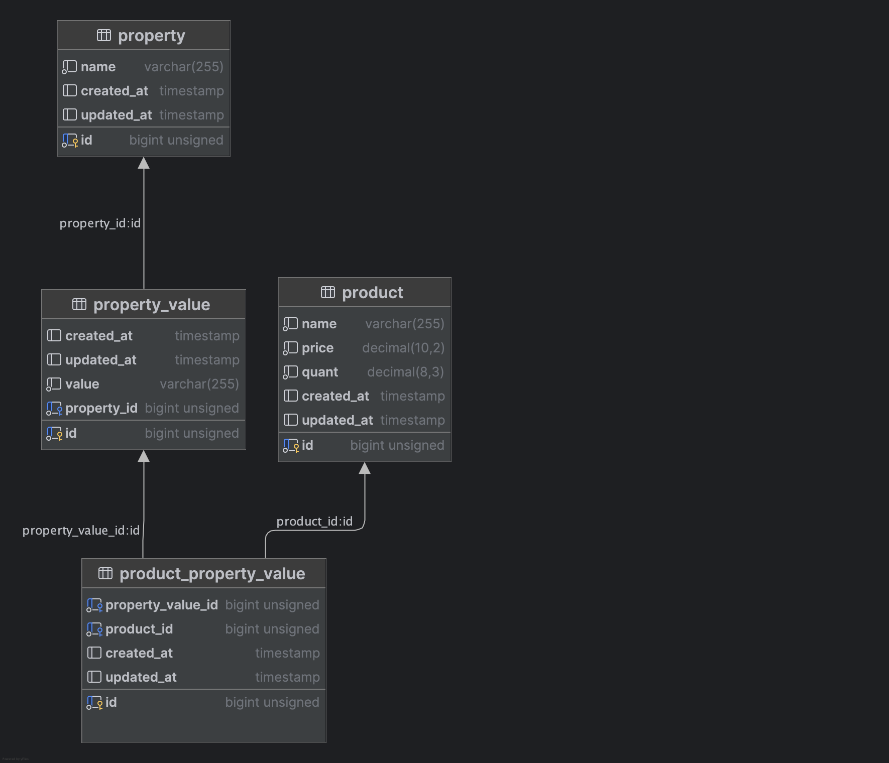
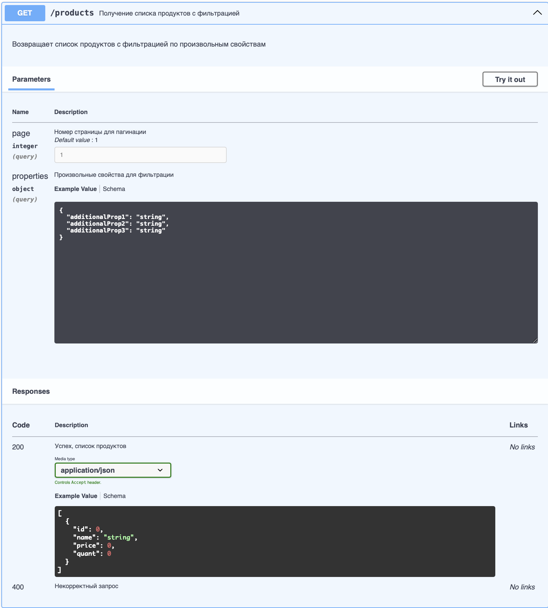

Это тестовое задание на создание API backend-а на фреймворке Laravel. В качестве БД используется MySQL.
Схема созданного каталога :


Здесь реализован “каталог товаров”. Товар: название, цена, количество. 


Свойства товара произвольные, значения свойств зависят от заголовков свойств. 
У одного товара может быть множество заголовков (имен свойств, например Бренд). У каждого заголовка свойства товара может быть несколько значений.

Реализована фильтрация товаров по множественному выбору через API, возвращается пагинированный по 40 товаров список. Страница задается ключом page=N,
по умолчанию N = 1.



Для развертывания : 
```php artisan serve```
```php artisan migrate```

Для тестов : 
```php artisan test --group=product```.
